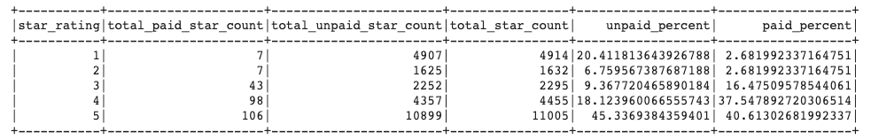

# Amazon-Vine-Analysis

## Purpose

The purpose of this project was to analyze Amazon review data to determine if a postitive bias in the Amazon Vine review program.

## Results

Using PySpark, I was able to create a table that broke down the data for the vine reviews vs the non-vine reviews to analyze whether there was bias in the reviews. Below you can see the table as well as a breakdown of the important information:

- Total Vine reviews: 261
- Total non-Vine reviews: 24,040
- Vine 5 star reviews: 106
- non-Vine 5 star reviews: 10899
- Percentage of Vine reviews that are 5 stars: 40.61%
- Percentage of non-Vine reviews that are 5 stars: 45.34%

## Summary

It appears as if there is not a positivity bias from the vine reviews. It is possible that a negativity bias exists as there is a 5% difference between the Vine and the non-Vine reviews, in favor of the non_vine reviews. This could be that Vine users can be more honest about their experince with the products as the did not have to pay for them, while non-Vine users may have felt the need to defend their purchase. However, the 5% difference could also be within the margin of error, as the total number of non-Vine reviews was significantly larger than the Vine reviews. Analysis of more vine review data would be necessary to determine if this was actually the case. Also, analysis of other departments to determine if this trend exists in all departments would help determine if there was a negativity bias.